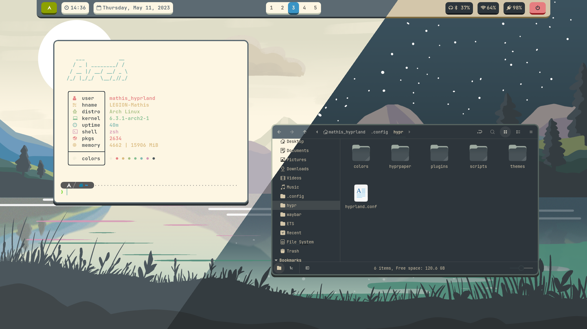
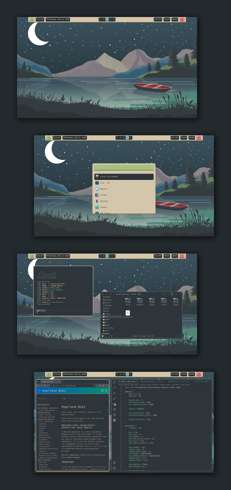

# summer-day-and-night
Hyprland rice for the summer themed competition. Wallpapers are made by me, PSD files are available.

## Themes: 
* GTK: [Everforest-Light-BL/Everforest-Dark-BL](https://www.gnome-look.org/p/1695467)
* Icons: [Everforest-Light/Everforest-Dark](https://www.gnome-look.org/p/1695476)
* Color schemes: [Everforest medium light/Everforest medium dark](https://github.com/sainnhe/everforest)
* Font: JetBrainsMono Nerd Font
* VsCode: [Everforest Light/Everforest Dark](https://vscodethemes.com/e/sainnhe.everforest/everforest-dark)

## Programs:
* Bar: Waybar
* Launcher: Wofi
* Terminal: Kitty
* Prompt: P10K
* Fetch: Nitch
* File manager: Nemo
* Browser: Firefox with Dark Reader
* Editor: VsCode

## Screenshots:

***

Summer Day | Summer Night
:---------:|:-----------:
 | 

# For the borders in Hyprland:
The borders are quite unique and have a sort of 3D effect at the bottom to match the bar and launcher I made. This is achievable only with some modifications to Hyprland's code for the moment, but it could easily be made into a plugin. Here are the necessary changes to make in `src/render/decorations/CHyprDropShadowDecoration.cpp`, inside `void CHyprDropShadowDecoration::draw(CMonitor* pMonitor, float a, const Vector2D& offset)`:

**Added `- (*PBORDERSIZE)` (line 82)**
```
// draw the shadow`
    wlr_box fullBox = {m_vLastWindowPos.x - *PSHADOWSIZE - (*PBORDERSIZE), m_vLastWindowPos.y - *PSHADOWSIZE, m_vLastWindowSize.x + 2.0 * *PSHADOWSIZE + (2.0 * *PBORDERSIZE), m_vLastWindowSize.y + 2.0 * *PSHADOWSIZE};
```

**Added `+ (2.0 * *PBORDERSIZE)` (line 101)**
```
    els`e {
        fullBox.x += ((m_vLastWindowSize.x + 2.0 * *PSHADOWSIZE + (2.0 * *PBORDERSIZE)) - NEWSIZE.x) / 2.0;
    }
```

**Added `+ 3` (line 153)**
```
    scaleBox(&fullBox, pMonitor->scale);
    g_pHyprOpenGL->renderRoundedShadow(&fullBox, (ROUNDING + 3) * pMonitor->scale, *PSHADOWSIZE * pMonitor->scale, a);
```
